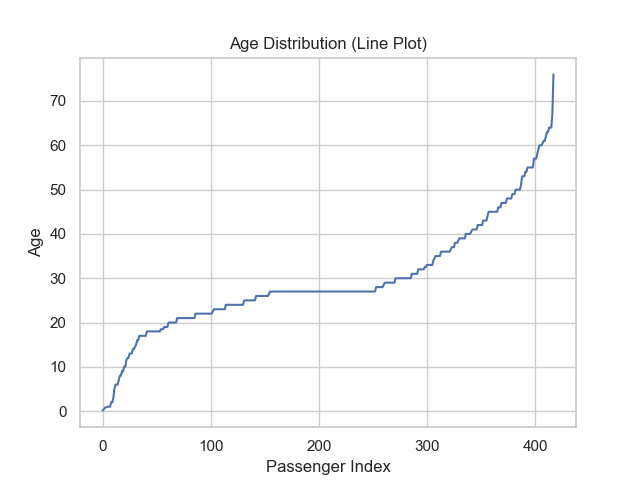
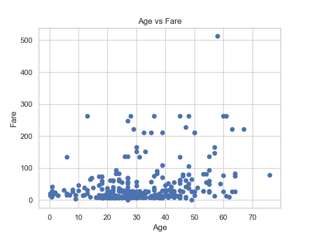
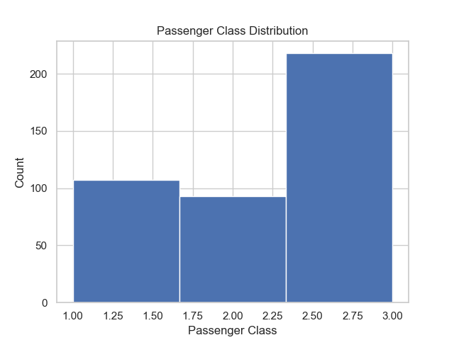
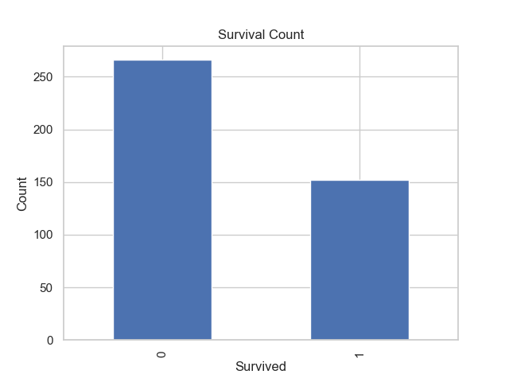
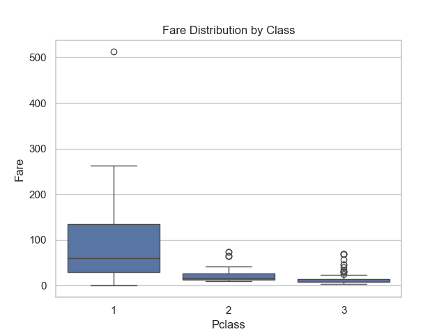
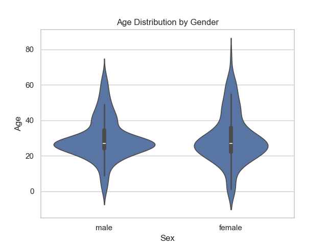
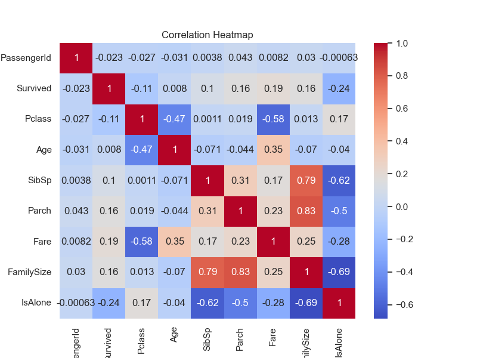
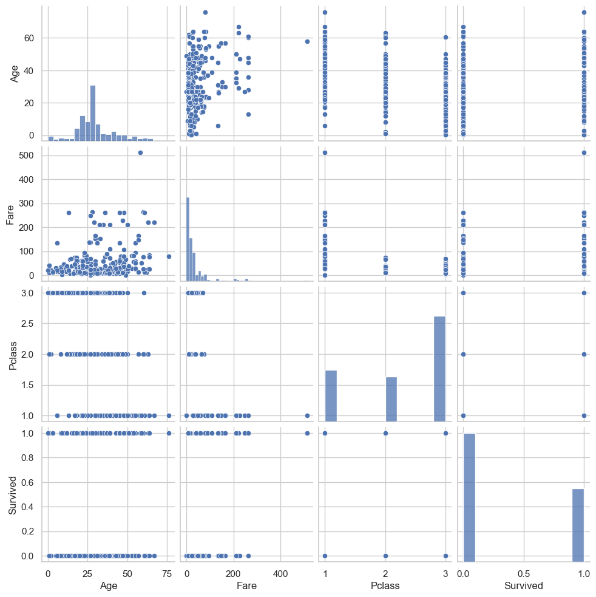

# ML-Internship-B01 🚀

## Project Description

This repository contains all the work completed during my **Machine Learning Internship (Batch B01)**.  
It includes Git & GitHub practice, documentation tasks, weekly learning progress, and Machine Learning-related activities.

The purpose of this repository is to:
- Practice **Git & GitHub workflows**
- Maintain **professional documentation**
- Track **weekly internship progress**
- Build a strong foundation in **Machine Learning**

## Table of Contents

- [Installation](#installation)
- [Usage](#usage)
- [Screenshots](#screenshots)
- [Technologies Used](#technologies-used)
- [Weekly Progress](#weekly-progress)
- [Project Structure](#project-structure)
- [Resources](#resources)
- [License](#license)
- [Contact](#contact)

## Installation

To use this repository locally, follow these steps:

# Clone the repository
git clone https://github.com/abuzarfarid430/ML-Internship-B01.git

# Navigate into the directory
cd ML-Internship-B01

## Usage

- Run Python scripts using:

python filename.py

- Open Jupyter notebooks using:

jupyter notebook

- Explore weekly tasks and scripts for learning Machine Learning fundamentals.

## Screenshots

### Titanic Dataset Visualizations (Week 2 – Task 2.3)

#### Age Distribution (Line Plot)

#### Age vs Fare (Scatter Plot)

#### Passenger Class Distribution (Histogram)

#### Survival Count (Bar Chart)

#### Fare by Passenger Class (Box Plot)

#### Age Distribution by Gender (Violin Plot)

#### Correlation Heatmap

#### Pair Plot of Numerical Features

## Technologies Used

- Python
- NumPy
- Pandas
- Matplotlib
- Seaborn
- Scikit-learn
- Jupyter Notebook
- Git & GitHub

## Weekly Progress

### Week 1: Git & GitHub Fundamentals
- Repository creation and setup
- Git commands (clone, add, commit, push)
- README.md documentation
- Branching and collaboration basics

### Week 2: Python for Machine Learning

#### Task 2.1: NumPy Array Operations
- Created `numpy_basics.py`
- Implemented 15 NumPy operations
- Practiced array creation, reshaping, slicing, and statistics

#### Task 2.2: Pandas Data Manipulation
- Created `pandas_exploration.ipynb`
- Cleaned Titanic dataset
- Handled missing values
- Performed feature engineering
- Exported cleaned dataset as `titanic_cleaned.csv`

#### Task 2.3: Data Visualization
- Created `data_visualization.py`
- Generated 8 plots using matplotlib and seaborn
- Saved plots in `visualizations/` folder
- Documented visual outputs in README

#### Task 2.4: Object-Oriented Programming for ML
- Created `data_preprocessor.py`
- Implemented `DataPreprocessor` class
- Added methods for:
  - Data loading
  - Missing value handling
  - Encoding categorical features
  - Feature scaling
  - Train-test splitting
- Generated final processed dataset `titanic_processed.csv`

## Resources

- Kaggle Titanic Dataset
- Scikit-learn Documentation
- Pandas Documentation
- Matplotlib & Seaborn Docs

## License

MIT License

Copyright (c) 2025 Abu Zar Farid

Permission is hereby granted, free of charge, to any person obtaining a copy  
of this software and associated documentation files (the "Software"), to deal  
in the Software without restriction.

## Contact

**Abu Zar Farid**  
🎓 Machine Learning Intern  
📧 Email: 22pwbcs0907@uetpeshawar.edu.pk  
🔗 GitHub: https://github.com/abuzarfarid430
